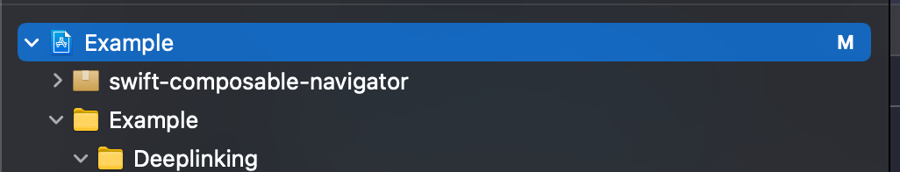
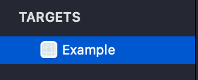
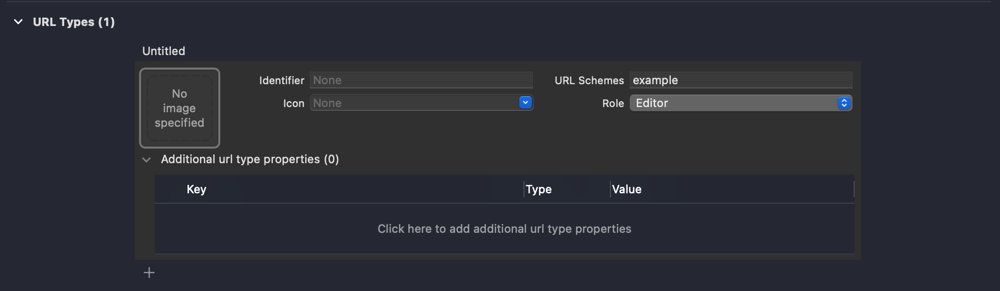

# ComposableDeeplinking
ComposableDeeplinking is part of the ComposableNavigator package and enables you to parse url scheme like `Deeplink`s to `RoutingPath`s. 

# Setting up an URL scheme
1. Open the project file<br/>


2. Select the app target<br/>


3. Select the info tab<br/>


4. Add the url scheme<br/>


# AppDelegate / SceneDelegate app life cycle
If your app is using the pre-iOS14 AppDelegate/SceneDelegate life cycle, you will need to override `scene(_ scene:, willConnectTo session: , options connectionOptions:)` and `scene(_ scene: UIScene, openURLContexts contexts: Set<UIOpenURLContext>)` in order to get url scheme based `Deeplink`s to work.

```swift
class SceneDelegate: UIResponder, UIWindowSceneDelegate {
  private var deeplinkHandler: DeeplinkHandler?

  func scene(
    _ scene: UIScene,
    willConnectTo session: UISceneSession,
    options connectionOptions: UIScene.ConnectionOptions
  ) { 
    // setup your app here
    // ...
    
    self.deeplinkHandler = DeeplinkHandler(
      navigator: navigator,
      parser: .exampleApp
    )

    // If the app performs a cold start from a url scheme deeplink, call openURLContexts to make sure the path is correctly updated
    self.scene(
        scene,
        openURLContexts: connectionOptions.urlContexts
    )
  }

  func scene(
    _ scene: UIScene,
    openURLContexts contexts: Set<UIOpenURLContext>
  ) {
    if let url = contexts.first?.url,
      // the matching parameter needs to match the URL scheme 
      // defined in the application's project file
       let deeplink = Deeplink(url: url, matching: "example") {
       deeplinkHandler?.handle(deeplink: deeplink)
    }
  }
}
```
# SwiftUI app life cycle
An example of how to integrate deeplinks into your SwiftUI application life cycle based application can be found in the [example application](https://github.com/Bahn-X/swift-composable-navigator/tree/main/Example) contained in this repository. Since iOS14, `Scene` objects allow to attach an [`onOpenURL`](https://developer.apple.com/documentation/swiftui/menu/onopenurl(perform:)) closure. Whenever the app gets opened by a url scheme deeplink, the registered perform closure is executed. The closure is also executed for universal links, so keep that in mind.

```swift
import ComposableDeeplinking
import ComposableNavigator
import SwiftUI

@main
struct ExampleApp: App {
  let navigator: Navigator
  let dataSource: Navigator.Datasource
  let deeplinkHandler: DeeplinkHandler

  init() {
    dataSource = Navigator.Datasource(
      root: HomeScreen() 
    )

    navigator = Navigator(dataSource: dataSource)

    deeplinkHander = DeeplinkHandler(
      navigator: navigator,
      parser: DeeplinkParser.exampleApp
    )
  }

  var body: some Scene {
    WindowGroup {
      Root(
        dataSource: dataSource,
        navigator: navigator,
        pathBuilder: // ...
      )
      .onOpenURL(
        perform: { url in
          // the matching parameter needs to match the URL  
          // scheme defined in the application's project file
          if let deeplink = Deeplink(url: url, matching: "example") { 
            deeplinkHandler.handle(deeplink: deeplink)
          }
        }
      )
    }
  }
}
```

# Deeplink parsers
Deeplink parsers parse `RoutingPath`s from `Deeplink`s. `DeeplinkParser`s are wrapper structs around a pure `(Deeplink) -> [AnyScreen]?` function and support composition. If a deeplink parser handles the input `Deeplink`, it returns a `RoutingPath` in the form of an `AnyScreen` array. If the deeplink parser is not responsible for parsing the deeplink, it returns nil.

Typically, applications using `ComposableDeeplinking` define one central `applicationDeeplinkParser`, composing all supported deeplinks. 

```swift
import ComposableDeeplinking

extension DeeplinkParser {
    /// Parses all supported deeplinks in the example app
    ///
    /// Supported deeplinks:
    /// * example://home/settings
    /// * example://detail?id={id}
    static let exampleApp: DeeplinkParser = .anyOf(
        .homeSettings,
        .details
    )
}
```

The `exampleApp` `DeeplinkParser` is composing two deeplink parsers. The `DeeplinkParser`s composed in the `exampleApp` `DeeplinkParser` can be compositions themselves, meaning that you can fully modularize your deeplink parsing, if needed. Use `prepending(path pathToEntrypoint: [AnyScreen], to parser: DeeplinkParser)` to navigate to your module's entrypoint.

Adding support for another deeplink can be achieved by adding a third entry to the .anyOf `DeeplinkParser`. Let's add a `DeeplinkParser` for `detail?id={id}/settings` `Deeplink`s.

```swift
import ComposableDeeplinking

extension DeeplinkParser {
    /// example://detail?id={id}/settings
    static let detailSettings = DeeplinkParser(
        parse: { deeplink in
            guard deeplink.components.count == 2,
                  deeplink.components[0].name == "detail",
                  case let .value(id) = deeplink.components[0].arguments?["id"],
                  deeplink.components[1].name == "settings"
            else {
                return nil
            }

            return [
                HomeScreen().eraseToAnyScreen(),
                DetailScreen(detailID: id).eraseToAnyScreen(),
                SettingsScreen().eraseToAnyScreen()
            ]
        }
    )
}
```

The url scheme representation are not tightly coupled to in-app `RoutingPaths` and only need to contain the information required to build up a valid routing path. This mean, that even if the application's navigation tree changes, your deeplinks can stay the same and we only need to adjust the application's deeplink parsing on the client-side. 

In order to support this newly added `DeeplinkParser`, we need to add it to our `exampleApp` `DeeplinkParser`. And that's it.

```swift
...
extension DeeplinkParser {
    /// Parses all supported deeplinks in the example app
    ///
    /// Supported deeplinks:
    /// * example://home/settings
    /// * example://detail?id={id}
    /// * example://detail?id={id}/settings
    static let exampleApp: DeeplinkParser = .anyOf(
        .homeSettings,
        .details,
        .detailSettings
    )
}
```

# Push notifications & Deeplinks
Deeplinks can also be part of a push notifications payload. We can hook into [`userNotificationCenter(_ center: UNUserNotificationCenter, didReceive response: UNNotificationResponse, withCompletionHandler completionHandler: @escaping () -> Void)`](https://developer.apple.com/documentation/usernotifications/unusernotificationcenterdelegate/1649501-usernotificationcenter) in [`UNUserNotificationCenterDelegate`](https://developer.apple.com/documentation/usernotifications/unusernotificationcenterdelegate), extract the deeplink url from the userInfo and pass it to our `DeeplinkHandler`, which replaces the routing path with the new routing path, if parsing succeeds.